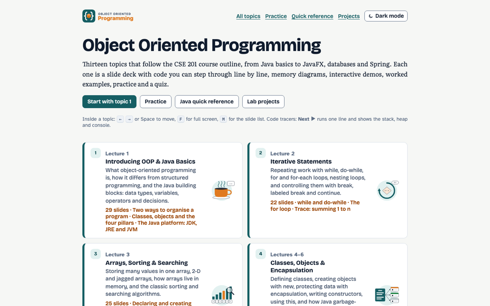
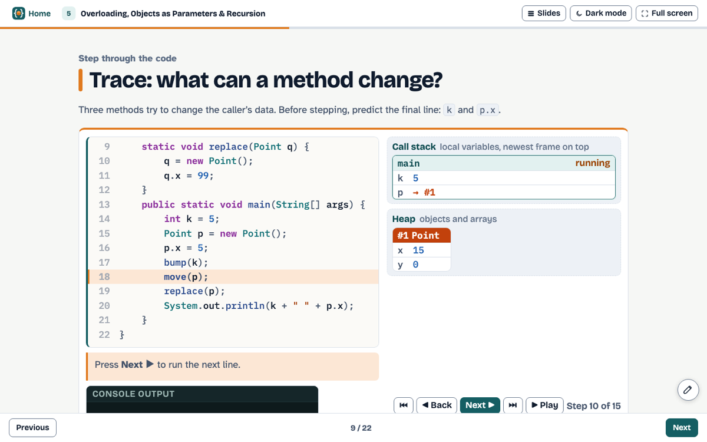

<div align="center">


# CSE 201 · Object Oriented Programming

**Interactive slide-deck course notes for Object Oriented Programming in Java.**

<a href="https://ayan-1829.github.io/CSE-201-Object-Oriented-Programming/"></a>


### [🌐 Open the live site →](https://ayan-1829.github.io/CSE-201-Object-Oriented-Programming/)

</div>

<br>

<p align="center"> </p>

<p align="center"><a href="https://ayan-1829.github.io/CSE-201-Object-Oriented-Programming/practice.html">Practice problems</a> · <a href="https://ayan-1829.github.io/CSE-201-Object-Oriented-Programming/reference.html">Java quick reference</a> · <a href="https://ayan-1829.github.io/CSE-201-Object-Oriented-Programming/projects.html">Lab projects</a></p>

## ✨ Highlights

<table>
<tr><td width="50%" valign="top">🧭&nbsp; 13 topic decks that follow the lectures, from Java basics to threads, GUI, JDBC and Spring</td><td width="50%" valign="top">🔍&nbsp; Step-through code tracer that shows the stack, heap, static area and console line by line</td></tr>
<tr><td width="50%" valign="top">🧩&nbsp; UML, memory and flow diagrams, live demos and a quiz in every topic</td><td width="50%" valign="top">📝&nbsp; Practice problems with answers, a searchable Java quick reference and lab projects with saved checklists</td></tr>
</table>

## 📚 Topics

13 decks · 296 slides. Each title opens the live deck.

| # | Topic | Slides |
|:--:|---|:--:|
| **1** | [Introducing OOP & Java Basics](https://ayan-1829.github.io/CSE-201-Object-Oriented-Programming/topics/01-introduction.html) | 29 |
| **2** | [Iterative Statements](https://ayan-1829.github.io/CSE-201-Object-Oriented-Programming/topics/02-loops.html) | 22 |
| **3** | [Arrays, Sorting & Searching](https://ayan-1829.github.io/CSE-201-Object-Oriented-Programming/topics/03-arrays.html) | 25 |
| **4** | [Classes, Objects & Encapsulation](https://ayan-1829.github.io/CSE-201-Object-Oriented-Programming/topics/04-classes-and-objects.html) | 22 |
| **5** | [Overloading, Objects as Parameters & Recursion](https://ayan-1829.github.io/CSE-201-Object-Oriented-Programming/topics/05-methods-and-recursion.html) | 22 |
| **6** | [Access Control, static, final & Nested Classes](https://ayan-1829.github.io/CSE-201-Object-Oriented-Programming/topics/06-access-static-final.html) | 20 |
| **7** | [Inheritance](https://ayan-1829.github.io/CSE-201-Object-Oriented-Programming/topics/07-inheritance.html) | 21 |
| **8** | [Overriding, Polymorphism & Abstract Classes](https://ayan-1829.github.io/CSE-201-Object-Oriented-Programming/topics/08-polymorphism-and-abstraction.html) | 22 |
| **9** | [Packages & Interfaces](https://ayan-1829.github.io/CSE-201-Object-Oriented-Programming/topics/09-packages-and-interfaces.html) | 22 |
| **10** | [Exception Handling](https://ayan-1829.github.io/CSE-201-Object-Oriented-Programming/topics/10-exception-handling.html) | 23 |
| **11** | [Multithreaded Programming](https://ayan-1829.github.io/CSE-201-Object-Oriented-Programming/topics/11-multithreading.html) | 23 |
| **12** | [Strings & Big Numbers](https://ayan-1829.github.io/CSE-201-Object-Oriented-Programming/topics/12-strings.html) | 23 |
| **13** | [GUI, Graphics, Databases & Spring](https://ayan-1829.github.io/CSE-201-Object-Oriented-Programming/topics/13-javafx-jdbc-spring.html) | 22 |

## ⌨️ Using the slides

| Key | Action |
|:--:|---|
| <kbd>←</kbd> <kbd>→</kbd> · <kbd>Space</kbd> | previous / next slide |
| <kbd>Home</kbd> · <kbd>End</kbd> | first / last slide |
| <kbd>F</kbd> | full screen for teaching |
| <kbd>M</kbd> | slide list |
| ✏️ | draw on any slide |

The address bar shows `#s=N`, so you can link straight to a slide. Light and dark themes follow your system, with a toggle in the header.

## 🚀 Run it locally

No build step, no server: clone the repository and open `index.html` in any modern browser.

```bash
git clone https://github.com/Ayan-1829/CSE-201-Object-Oriented-Programming.git
open CSE-201-Object-Oriented-Programming/index.html      # macOS · use start on Windows, xdg-open on Linux
```

<details>
<summary><b>🛠 Developer notes: folder layout and how the pages are built</b></summary>

```text
Structure:
  index.html        topic list
  topics/*.html     13 slide decks (←/→, F full screen, M slide list)
  practice.html     all practice problems with answers
  reference.html    searchable Java quick reference
  projects.html     lab projects with saved checklists
  robots.txt, sitemap.xml   SEO files for https://ayan-1829.github.io/CSE-201-Object-Oriented-Programming/
                    (search-and-replace this address if the site is published elsewhere)
  site.webmanifest, 404.html  web-app manifest and "not found" page
  img/og/           1200x630 social-share image for every page
  js/analytics.js   shared cookieless analytics tracker (do not edit; same file in every project)
  js/course-events.js  course events for the Course analytics Sheet: slide titles, quizzes, tools, answers
  js/core.js        helpers, theme, storage
  js/java.js        Java syntax highlighter
  js/tracer.js      step-through code tracer (stack, heap, static area, console)
  js/traces.js      the traced programs
  js/figs.js        UML / memory / flow diagram generator + figures
  js/demos-*.js     interactive demos
  js/slides.js      slide engine; js/annotate.js drawing layer; js/quiz.js quizzes
```

</details>

## 🎓 All courses

| | Course | Live site | Repository |
|:--:|---|:--:|:--:|
|  | **CSE 201** · Object Oriented Programming **(this one)** | [Open](https://ayan-1829.github.io/CSE-201-Object-Oriented-Programming/) | [GitHub](https://github.com/Ayan-1829/CSE-201-Object-Oriented-Programming) |
|  | **CSE 202** · Object Oriented Programming Lab | [Open](https://ayan-1829.github.io/CSE-202-Object-Oriented-Programming-Lab/) | [GitHub](https://github.com/Ayan-1829/CSE-202-Object-Oriented-Programming-Lab) |
|  | **CSE 203** · Digital Logic Design | [Open](https://ayan-1829.github.io/CSE-203-Digital-Logic-Design/) | [GitHub](https://github.com/Ayan-1829/CSE-203-Digital-Logic-Design) |
|  | **CSE 308** · Design Project I | [Open](https://ayan-1829.github.io/CSE-308-Design-Project-I/) | [GitHub](https://github.com/Ayan-1829/CSE-308-Design-Project-I) |

---

<p align="center">Made by <b>Ayan Sarkar</b> · Green University of Bangladesh</p>
